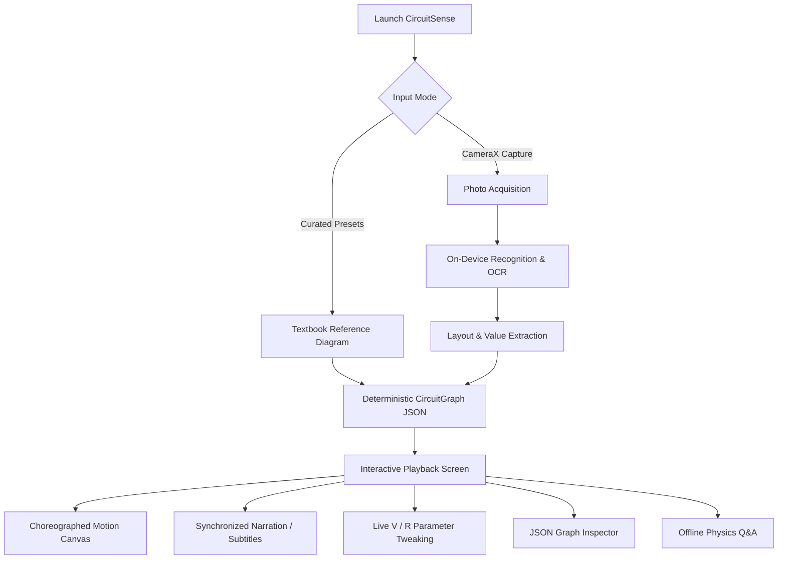
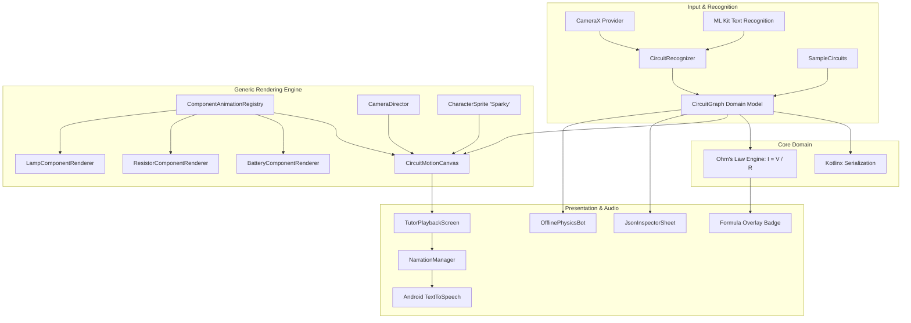

# CircuitSense

> Native Android motion-graphics physics tutor that transforms static textbook circuit diagrams into structured JSON graphs and cinematic, interactive visual explanations.

[](https://developer.android.com)
[](https://kotlinlang.org)
[](https://developer.android.com/jetpack/compose)
[](https://gradle.org)

---

## 1. Overview

Students diagnosed with ADHD or working memory processing constraints frequently struggle with static textbook schematics. Conventional circuit diagrams represent dynamic physical phenomena—such as electron drift, electric fields, and resistance dissipation—as frozen, abstract symbols ($V = IR$). This creates high cognitive friction and prevents learners from developing accurate mental models.

**CircuitSense** addresses this gap by converting textbook circuit diagrams into structured, animated explanations on-device:
1. An image of an Ohm's Law circuit (voltage source, resistor, wire loop) is captured via camera or selected from bundled reference schematics.
2. An on-device vision pipeline evaluates the image using Google ML Kit and geometric layout analysis, extracting component parameters and coordinates into a validated, strongly typed **Circuit JSON Graph**.
3. A decoupled, registry-based Jetpack Compose Canvas renderer reads this JSON schema and executes a 4-beat cinematic camera choreography with synchronized Text-to-Speech (TTS) narration, localized visual focus spotlights, and real-time physics parameter recalculation.

The entire analysis and rendering execution runs completely offline on the host Android device, requiring zero cloud connectivity and zero external API dependencies.

---

## 2. Key Capabilities

### On-Device Diagram Digitization
- **Mechanism**: Combines CameraX frame capture with ML Kit Optical Character Recognition (OCR) and geometric layout estimation.
- **Utility**: Extracts voltage ($V$) and resistance ($R$) numerical values and maps component coordinates directly into the target data schema without cloud latency or privacy exposure.

### Generic Registry-Based Motion-Graphics Renderer
- **Mechanism**: Decouples the rendering loop from concrete component types using an extensible strategy pattern (`ComponentRenderer` registered in `ComponentAnimationRegistry`).
- **Utility**: Eliminates hardcoded `if-else` canvas branches, enabling the engine to render arbitrary circuit topologies adhering to the JSON schema.

### 4-Beat Attention Choreography
- **Mechanism**: A dedicated `CameraDirector` manages continuous viewport transformations (scale, translation, and lerp easing) across discrete pedagogical phases:
  - **Beat 1: Battery Focus (2.5x)**: Visualizes chemical charge separation and electric potential formation ("Current is Born").
  - **Beat 2: Conductor Transit (1.8x)**: Tracks electron drift along the conductor with trailing motion particles.
  - **Beat 3: Resistor Collision (2.6x)**: Visualizes lattice scattering, resistive friction, and energy dissipation as heat.
  - **Beat 4: Closed-Loop Equilibrium (1.0x)**: Restores the full circuit view with continuous current circulation where particle drift velocity scales directly with calculated amperage ($I = V / R$).
- **Utility**: Implements spatial focus anchoring to retain attention in neurodivergent learners without visual disorientation.

### Synchronized Narration & Accessibility Subtitles
- **Mechanism**: Orchestrates Android's native `TextToSpeech` engine through a stateful `NarrationManager` coupled to active animation beats.
- **Utility**: Provides high-contrast, synchronous visual captions and auditory cues, supporting both visual and auditory learning modalities.

### Real-Time Parameter Recalculation (Live Ohm's Law HUD)
- **Mechanism**: Bidirectional reactive state recalculates $I = V / R$ instantaneously upon slider manipulation, adjusting particle drift velocity and JSON graph models in real time.
- **Utility**: Reinforces intuitive cause-and-effect understanding of electrical resistance and potential difference.

### Runtime JSON Inspector & Offline Physics Assistant
- **Mechanism**: Includes an interactive modal drawer rendering the raw serialized JSON graph and an isolated physics inference engine (`OfflinePhysicsBot`) answering domain questions locally.
- **Utility**: Verifies data-driven execution for technical evaluators while providing on-demand conceptual clarification for students.

---

## 3. Product & User Experience



### User Workflow
1. **Acquisition**: The user aligns a printed or hand-drawn Ohm's Law circuit diagram within the CameraX viewfinder reticle and triggers capture. Alternatively, any of four curated textbook presets (9V/100Ω, 24V/60Ω, 12V/300Ω, 3V/15Ω) can be selected for instant baseline evaluation.
2. **Analysis**: On-device OCR processes voltage and resistance markings while geometric heuristics determine node placement.
3. **Playback**: The application transitions to the tutor screen, automatically initiating the cinematic 4-beat animation and synchronized narration.
4. **Interaction**: The user can scrub through beats, adjust animation playback speed (0.75x to 2.0x), mute audio, fine-tune voltage and resistance sliders to observe velocity changes, or open the JSON inspector to examine the underlying schema.

---

## 4. Architecture

CircuitSense is structured around strict separation of concerns, ensuring that the recognition layer, domain model, rendering engine, and UI components remain completely decoupled.



### Layer Responsibilities

- **`com.circuitsense.model`**: Defines strongly typed, immutable data structures (`CircuitGraph`, `CircuitComponent`, `CircuitConnection`, `CircuitFormula`) with built-in serialization and physics calculation methods.
- **`com.circuitsense.recognition`**: Manages ML Kit OCR text scanning, numerical regex parsing, and geometric mapping to normalize image coordinates onto a stable reference canvas.
- **`com.circuitsense.renderer`**: Encapsulates the generic rendering pipeline:
  - `ComponentAnimationRegistry`: Dynamic registry decoupling component draw routines from canvas logic.
  - `CameraDirector`: Computes target transforms and smooth ease-in-out interpolations for cinematic zooms.
  - `CharacterSprite`: Handles parametric particle and cartoon electron rendering with emotional states (excited flow vs. lattice compression).
- **`com.circuitsense.audio`**: Manages the Android `TextToSpeech` lifecycle, thread synchronization, and emission of high-contrast subtitle StateFlows.
- **`com.circuitsense.ui`**: Jetpack Compose screen implementations, responsive layout components, modal sheets, and the dark-mode design system.
- **`com.circuitsense.qa`**: Decoupled, rule-grounded physics assistant providing offline answers without destabilizing the core pipeline.

---

## 5. Tech Stack

| Layer | Technology | Purpose |
| :--- | :--- | :--- |
| **Platform** | Android SDK (minSdk 26, targetSdk 34) | Host execution platform |
| **Language** | Kotlin 1.9.24 / JVM 17 | Core application programming language |
| **UI Framework** | Jetpack Compose (BOM 2024.05.00) | Declarative UI, reactive state, and hardware-accelerated Canvas |
| **Design System** | Material 3 (`androidx.compose.material3`) | Dark-theme UI components and controls |
| **Camera** | CameraX 1.3.3 | Live viewfinder preview and lifecycle-bound image capture |
| **Vision & ML** | Google Play Services ML Kit (Text Recognition 19.0.0) | On-device text recognition for circuit parameter extraction |
| **Data Serialization** | `kotlinx-serialization-json` 1.6.3 | JSON encoding, decoding, and schema validation |
| **Asynchrony** | Kotlin Coroutines & Flows 1.8.0 | Non-blocking image processing and animation timing |
| **Speech** | Android Native `android.speech.tts.TextToSpeech` | On-device speech synthesis synced to animation phases |
| **Testing** | JUnit 4.13.2 | Unit testing for physics calculations, schemas, and cameras |
| **Build System** | Gradle 8.14.3 / AGP 8.4.2 | Dependency resolution, compilation, and APK packaging |

---

## 6. Project Structure

```text
LETS GOO YRR/
├── app/
│   ├── build.gradle.kts                 # Application-level dependencies, SDK levels, and Compose config
│   └── src/
│       ├── main/
│       │   ├── AndroidManifest.xml      # Hardware camera feature and runtime permission declarations
│       │   ├── java/com/circuitsense/
│       │   │   ├── MainActivity.kt      # Root entry activity and screen state router
│       │   │   ├── audio/
│       │   │   │   └── NarrationManager.kt   # TTS wrapper and reactive subtitles engine
│       │   │   ├── data/
│       │   │   │   └── SampleCircuits.kt     # Curated reference circuit presets
│       │   │   ├── model/
│       │   │   │   └── CircuitGraph.kt       # Locked Circuit JSON schema and Ohm's Law formulas
│       │   │   ├── qa/
│       │   │   │   └── OfflinePhysicsBot.kt  # Decoupled offline physics Q&A assistant
│       │   │   ├── recognition/
│       │   │   │   └── CircuitRecognizer.kt  # On-device ML Kit OCR and geometry extraction
│       │   │   ├── renderer/
│       │   │   │   ├── CameraDirector.kt     # Viewport matrix transforms and interpolation
│       │   │   │   ├── CharacterSprite.kt    # Electron particle and cartoon face rendering
│       │   │   │   └── ComponentAnimationRegistry.kt # Extensible component rendering strategies
│       │   │   └── ui/
│       │   │       ├── canvas/
│       │   │       │   └── CircuitMotionCanvas.kt    # Main Compose hardware-accelerated canvas
│       │   │       ├── components/
│       │   │       │   └── JsonInspectorSheet.kt     # Raw JSON graph inspector bottom sheet
│       │   │       ├── screens/
│       │   │       │   ├── CameraCaptureScreen.kt    # Viewfinder, reticle, and preset selector
│       │   │       │   └── TutorPlaybackScreen.kt    # Interactive tutor screen with controls
│       │   │       └── theme/
│       │   │           ├── Color.kt              # Color tokens (high-contrast neon and dark space)
│       │   │           └── Theme.kt              # Material 3 dark color scheme definition
│       │   └── res/
│       │       ├── values/                       # Strings, colors, and styles
│       │       └── xml/                          # Backup and data extraction security rules
│       └── test/java/com/circuitsense/
│           ├── CameraDirectorTest.kt             # Viewport transform and lerp bounds tests
│           ├── CircuitGraphSerializationTest.kt  # Bidirectional JSON schema verification
│           ├── ComponentRegistryTest.kt          # Renderer registration and fallback checks
│           └── OhmsLawCalculationTest.kt         # V = IR numerical accuracy and guard tests
├── gradle/
│   └── wrapper/
│       ├── gradle-wrapper.jar           # Binary wrapper launcher
│       └── gradle-wrapper.properties    # Gradle 8.14.3 distribution specification
├── build.gradle.kts                     # Root build configuration
├── gradle.properties                    # JVM memory allocation (-Xmx2048m) and AndroidX flags
├── gradlew / gradlew.bat                # Platform execution scripts
├── local.properties                     # Local Android SDK directory path
└── settings.gradle.kts                  # Repository resolution and project inclusion
```

---

## 7. Core Workflow

```text
[Input Image (Bitmap / Frame)]
             ↓
[ML Kit Latin TextRecognizer]
             ↓
[Regex Extraction: Voltage (e.g. '9V') & Resistance (e.g. '100ohm')]
             ↓
[Spatial Layout Mapping -> Normalized 600x400 Canvas Coordinates]
             ↓
[Validation & Formula Construction: I = V / R]
             ↓
[CircuitGraph JSON Serialization]
             ↓
[ComponentAnimationRegistry Resolution]
             ↓
[CameraDirector Matrix Transform (Pan / Zoom)]
             ↓
[Compose Canvas Invalidation (~60 FPS) + TTS Audio Emission]
```

1. **OCR Parsing**: Text blocks returned from ML Kit are scanned with regular expressions (`\b\d+(\.\d+)?\s*[Vv]\b` and `\b\d+(\.\d+)?\s*(ohm|ohms|Ω|R)\b`).
2. **Canonical Mapping**: Detected symbols and values are normalized onto a uniform 600x400 coordinate space to ensure layout stability across varying mobile aspect ratios.
3. **Graph Instantiation**: A `CircuitGraph` instance is created with verified components, connections, and calculated formula parameters.
4. **Rendering Walk**: During every frame cycle, the canvas retrieves the appropriate `ComponentRenderer` for each element in `graph.components` and invokes its drawing instructions within the transformed coordinate frame.

---

## 8. Circuit JSON Schema Specification

CircuitSense strictly adheres to the following JSON schema format. The generic animation renderer reads only this structure:

```json
{
  "components": [
    {
      "id": "battery1",
      "type": "battery",
      "value": "9V",
      "x": 120.0,
      "y": 240.0,
      "label": "DC Battery (9V)",
      "unit": "V"
    },
    {
      "id": "resistor1",
      "type": "resistor",
      "value": "100ohm",
      "x": 460.0,
      "y": 240.0,
      "label": "Resistor (100Ω)",
      "unit": "Ω"
    }
  ],
  "connections": [
    {
      "from": "battery1",
      "to": "resistor1",
      "path": "top_wire"
    },
    {
      "from": "resistor1",
      "to": "battery1",
      "path": "bottom_wire"
    }
  ],
  "formula": {
    "type": "ohms_law",
    "V": 9.0,
    "I": 0.09,
    "R": 100.0
  }
}
```

### Schema Properties

| Field | Type | Description |
| :--- | :--- | :--- |
| `components` | `Array<Object>` | List of physical elements present in the circuit. |
| `components[].id` | `String` | Unique identifier (e.g., `"battery1"`, `"resistor1"`). |
| `components[].type` | `String` | Component classification (`"battery"`, `"resistor"`, `"lamp"`, etc.) resolved by the registry. |
| `components[].value`| `String` | Human-readable measurement label (e.g., `"9V"`, `"100ohm"`). |
| `components[].x, y` | `Float` | Normalized center anchor coordinates on reference canvas. |
| `connections` | `Array<Object>` | Directed wiring paths linking components into a closed loop. |
| `connections[].from`| `String` | Source component ID. |
| `connections[].to` | `String` | Destination component ID. |
| `connections[].path`| `String` | Geometric route designation (`"top_wire"`, `"bottom_wire"`). |
| `formula` | `Object` | Mathematical and physical properties governing the circuit. |
| `formula.type` | `String` | Formula model (`"ohms_law"`). |
| `formula.V` | `Double` | Electric potential in Volts ($V$). |
| `formula.R` | `Double` | Electrical resistance in Ohms ($\Omega$). |
| `formula.I` | `Double` | Calculated electrical current in Amperes ($I = V / R$). |

---

## 9. Installation & Setup

### Prerequisites

- **Java Development Kit (JDK)**: Version 17 (Microsoft Build of OpenJDK 17 or Eclipse Temurin 17).
- **Android SDK**: Android 14.0 (API Level 34) platform and build-tools installed.
- **Gradle**: 8.14.3 (provided via included wrapper `gradlew`).
- **Physical Device or Emulator**: Running Android 8.0 (API Level 26) or higher with camera support.

### Clone & Environment Configuration

1. Clone the repository:
   ```bash
   git clone <repository-url>
   cd "LETS GOO YRR"
   ```

2. Configure Android SDK location in `local.properties`:
   ```properties
   sdk.dir=C\:\\Android\\android-sdk
   ```
   *(Adjust the path above to match your local Android SDK installation directory).*

---

## 10. Building and Running

All build tasks can be executed via the included Gradle wrapper scripts (`gradlew` on Unix/macOS or `gradlew.bat` on Windows).

### Assemble Debug APK
Compile the project and generate the debug APK:
```bash
./gradlew assembleDebug
```
*Output location:* `app/build/outputs/apk/debug/app-debug.apk`

### Install and Run on Device
Deploy the debug build directly to an attached Android device or running emulator:
```bash
./gradlew installDebug
```

### Launch Main Activity via ADB (Optional)
```bash
adb shell am start -n com.circuitsense/.MainActivity
```

---

## 11. Testing

The repository contains automated unit tests verifying schema integrity, mathematical correctness, camera transforms, and registry lookups.

### Run Unit Tests
Execute the local unit test suite:
```bash
./gradlew testDebugUnitTest
```

### Test Suite Coverage

| Test Class | Scope & Verification |
| :--- | :--- |
| `CircuitGraphSerializationTest` | Verifies bidirectional serialization and deserialization of the locked Circuit JSON schema using `kotlinx-serialization`. |
| `OhmsLawCalculationTest` | Validates numerical accuracy of $I = V / R$, dynamic parameter updates, and division-by-zero guards ($R \le 0$). |
| `CameraDirectorTest` | Ensures zoom levels, pan offsets, and lerp interpolation factors remain within expected numerical boundaries for all 5 story beats. |
| `ComponentRegistryTest` | Verifies registration of default renderers (`battery`, `resistor`, `lamp`) and checks fallback behavior for unknown component types. |

---

## 12. Security & Privacy Considerations

- **Zero Cloud Data Transmission**: All visual inference, text recognition, and speech synthesis run strictly on-device. No images, camera feeds, or telemetry are transmitted across external networks.
- **Scoped Permission Model**: The application requests only `android.permission.CAMERA` to capture schematics. Camera hardware access is released immediately when navigating away from the capture screen.
- **Safe Fallback Processing**: If camera permissions are denied, the system prevents execution failures by directing the user to select from verified reference diagrams.
- **No Insecure Storage**: Analyzed image bitmaps are processed entirely in volatile memory and recycled via garbage collection without persisting unencrypted temporary files to shared device storage.

---

## 13. Error Handling & Reliability

- **Explicit OCR Fallback Banner (No Silent Defaults)**: If visual scanning or handwriting ambiguity prevents high-confidence extraction of voltage or resistance, the system does NOT silently substitute values. The UI surfaces an explicit amber alert banner informing the user (*"Couldn't read values clearly from diagram — showing reference circuit (9V, 100Ω)"*), enabling immediate parameter tweaking via sliders or rescanning.
- **Division-by-Zero Guard**: If a zero or negative resistance value is entered or parsed, the formula engine clamps the value to a safe minimum ($R = 0.01\Omega$), preventing arithmetic `Infinity` or `NaN` from propagating to particle velocity calculations.
- **Lifecycle-Bound Camera**: CameraX use cases are bound to `LocalLifecycleOwner`, preventing memory leaks or orientation crash loops during configuration changes.
- **Decoupled Assistant Failure Isolation**: The `OfflinePhysicsBot` module operates independently of the primary rendering pipeline; any issue encountered in the Q&A sheet will not terminate or freeze active motion canvas playback.

---

## 14. Performance & Engineering Considerations

- **Hardware-Accelerated Canvas**: The motion graphics pipeline relies on Jetpack Compose `Canvas` drawing operations backed by Android hardware acceleration, maintaining continuous 60 FPS animation loops.
- **Viewport Matrix Transforms**: Camera zoom and pan choreography are applied via `DrawScope.withTransform` (native matrix translation and scaling), avoiding costly re-allocation or bitmap regeneration during viewport transitions.
- **Garbage Collection Efficiency**: Path objects and drawing colors are computed with minimal temporary allocations in frame drawing loops, minimizing GC pauses on low-memory mobile hardware.

---

## 15. Known Limitations

- **Circuit Scope (MVP Lock)**: The current version is strictly scoped to single-loop Ohm's Law circuits ($V = IR$: one DC voltage source, one resistor, and connecting conductor paths). Complex networks, parallel branches, AC sources, inductors, and capacitors are not recognized in this build.
- **Handwriting Variability**: On-device OCR accuracy depends on legible numerical and unit markings (e.g., standard "V" and "Ω" or "ohm" notation). Heavily stylized or degraded drawings may trigger the canonical fallback values.
- **Speech Engine Dependency**: TTS playback quality and voice timbre depend on the active speech synthesis engine and language data installed on the target Android device.

---

## 16. Roadmap

### Phase 2: Multi-Component & Kirchhoff's Laws
- [ ] Extend the JSON schema to support multi-branch parallel circuits.
- [ ] Implement Kirchhoff's Current Law (KCL) junction splitting animations and Kirchhoff's Voltage Law (KVL) potential drops.

### Phase 3: Hardware NPU Acceleration
- [ ] Port offline physics reasoning to Google MediaPipe Tasks GenAI with quantized Gemma 1B models targeting on-device NPU execution.
- [ ] Integrate edge contour vectorization using OpenCV for Android to improve arbitrary hand-drawn trace extraction.

### Phase 4: AR Projection
- [ ] Integrate ARCore to project the animated cartoon electron flow directly onto physical solderless breadboards.

---

## 17. Contributing

1. Fork the repository.
2. Create a feature branch:
   ```bash
   git checkout -b feature/component-capacitor
   ```
3. Commit your changes following standard conventional commit conventions:
   ```bash
   git commit -m "feat(renderer): add CapacitorComponentRenderer to registry"
   ```
4. Verify that all automated tests pass:
   ```bash
   ./gradlew testDebugUnitTest
   ```
5. Push to your branch and submit a Pull Request.

---

## 18. License

This repository is currently maintained for the **iQOO Hackathon**. Licensing terms have not yet been specified. All rights reserved.
